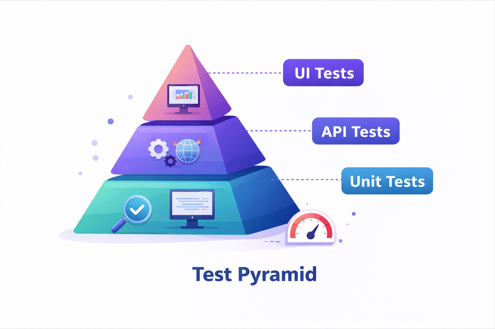

# QA Engineering Roadmap

  

Documentation of my learning journey in <strong>Quality Engineering, Test Automation and QA Architecture</strong>.

---

## Purpose of This Repository

This repository works as a **QA Engineering knowledge base**.

It contains documentation about:

- Test Automation
- QA Architecture
- CI/CD for testing
- Testing strategies
- Career roadmap in Quality Engineering

The objective is to evolve from **test automation practitioner** to **Quality Engineering professional**.

---

## Test Pyramid

  

The **Test Pyramid** represents the ideal balance between different types of automated tests.

### Unit Tests
Fast tests that validate individual components of the system.

### API Tests
Validate service logic and backend behavior.

### UI Tests
Validate complete user flows through the interface.

Following the test pyramid helps maintain **fast, stable and scalable automation suites**.

---

## Repository Structure

- `assets/` → repository banner and visual assets  
- `diagrams/` → technical diagrams such as the test pyramid  
- `career-roadmap/` → career planning and learning evolution  
- `automation/` → documentation about UI, API and data-driven automation  
- `frameworks/` → notes about automation framework architecture  
- `ci-cd/` → CI/CD documentation and pipeline notes  

---

## Topics Covered

### Test Automation
Automation strategies and tools used in modern software testing.

### API Testing
Backend validation and service testing strategies.

### Test Architecture
Design of scalable test frameworks.

### CI/CD
Continuous integration pipelines for automated testing.

### QA Engineering Practices
Quality-focused engineering mindset and practices.

---

## Related Project

Main automation framework project:

**QA Automation Cypress Framework**

https://github.com/ivaneidepmn/qa-automation-cypress-framework

---

## Author

**Ivaneide Monteiro**

QA Automation Engineer focused on:

- Test Automation  
- Quality Engineering  
- CI/CD Pipelines  

---

⭐ If you find this repository useful, consider giving it a star.